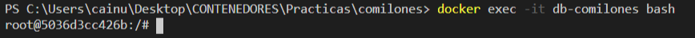
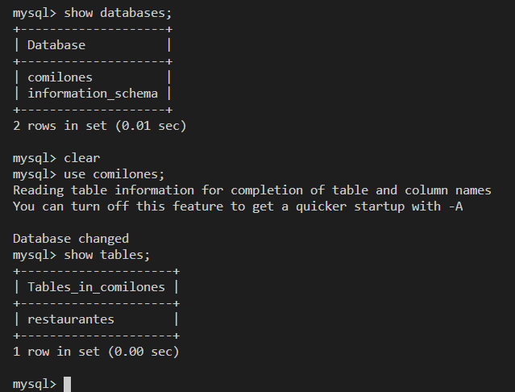

# comilones
Aplicació web amb cercador i valoracions de restaurants, amb tecnologies PHP i MySQL, desplegada mitjançant Docker.

## Como acceder a db-comilones a través de consola

Para acceder a la consola **Mysql** primeramente tendremos que acceder a la kernel de su contenedor. 

Para ello utilizaremos el siguiente comando:
`docker exec -it db-comilones bash`

Dentro de la consola linux debemos acceder a la consola de **Mysql**,
introduciendo el siguiente comando con nombre del usuario: `user`.
Se nos solicitará la contraseña:
`mysql -u user -p`

Finalmente, ya podemos operar con comandos **Mysql**

